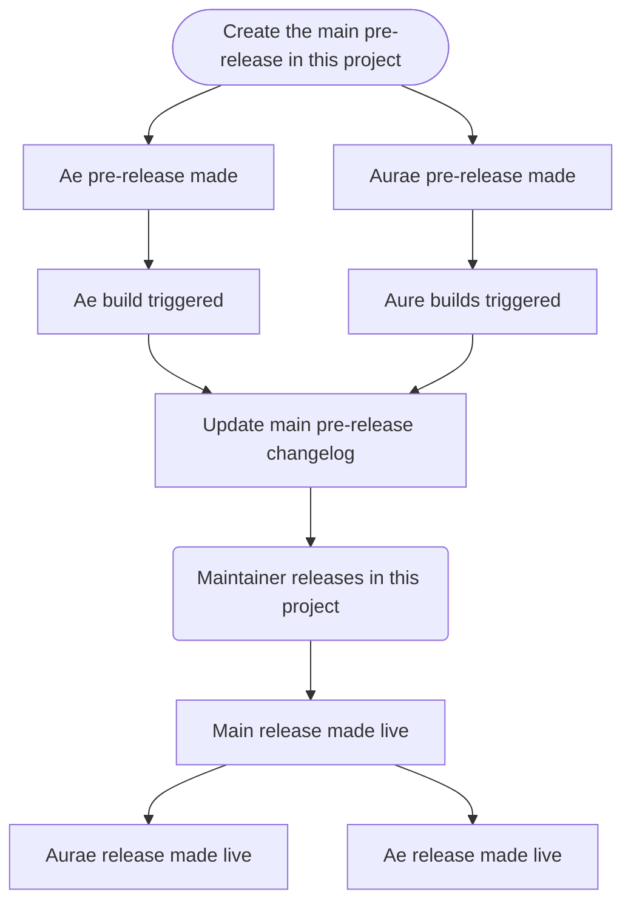

# Releases

Releases will be created in this repository for all official builds of `aurae` and associated projects.

## Versioning

### Stable Release

Stable versions will follow a `vX.Y.Z` format. Versions will be consistent across everything being released.

-   `X`: A major version - This represents a significant change in the project. It can include breaking changes and new features.
-   `Y`: Minor version - This represents new features and improvements to the project. It can also include non-breaking changes.
-   `Z`: Patch version - This represents bug fixes and other small changes to the project.

### Development Releases

Code that has not reached stability will be versioned with an additional segment to indicate it is not release.

-   `bX` - Beta releases will be built from the `commits` referenced in the release.yaml file. They can be used as a staging ground for release and are intended for testing and feedback from the community.

-   `aX` - Alpha releases will be built from the `HEAD` of each project. They are intended for testing and development purposes. An `a1` will indicate it is the first alpha release of this new version. As additional are built the `a` digit will increment.

-   `xX` - Experimental releases. These are intended for development purposes. There is no compatibility guarantee with these releases.

## Release schedule

| Release | Schedule  |
| ------- | --------- |
| alpha   | as needed |
| beta    | as needed |

## Cutting a versioned release

-   A PR to the `release` (this one) repository is prepped with any appropriate changes to the release json `release.json` if needed.
    -   Add any projects to be included in the upcoming release to this document.
-   Create a new pre-release from the main branch of this project.
    -   The new version is chosen at this point.
-   When this pre-release is created in the `release` project, it will kick off a build in each project listed in the `release.json`, at the branch or commit hash defined in that document.
    -   Each project we want to build will catch this event (using `ae` as an example here) .
    -   `Ae` will create a new github pre-release in its own project. It will share the tag sent from the `release` project. Changelogs will be generated in the `ae` project from commit messages.
    -   The `ae` pre-release will trigger building the artifacts required for the release in `ae`.
    -   The `ae` project will load the version from the tag `release` project tag. It will then inspect the `release.json` file to build the correct architectures and commit references.
-   Once all of the projects have completed their artifact builds, and the maintainers are happy with the builds, the release in this repository is "released".
    -   Maintainers can change notes on any of the pre-releases
    -   Projects then use this as a trigger to set their own releases as "released".



### Troubleshooting

#### A subproject GHA artifact release fails

If the sub project (`aurae` for example) artifact GHA run fails, it will leave a pre-release that has a tag pointed to the broken version. If a new git push to `aurae` is required to fix the GHA run, you will need to:

1. Get `aurae` to a working state
2. Delete the tag associated with the wrong version in the `aurae` project
3. Delete the pre-release associated with the wrong version in the `aurae` project.
4. Re-run the `030-ubuntu-latest-make-create-releases` job in the `release` project to re-setup any missing sub-project pre-releases. This will use the correct git sha for the tag and release then.

### Version JSON

This document describes the release. It includes each binary being released. The name here would map to the repository under the `aurae-runtime` Github organization.

```json
{
    "aurae": "main",
    "auraescript": "main",
    "aer": "main",
    "ae": "main"
}
```
